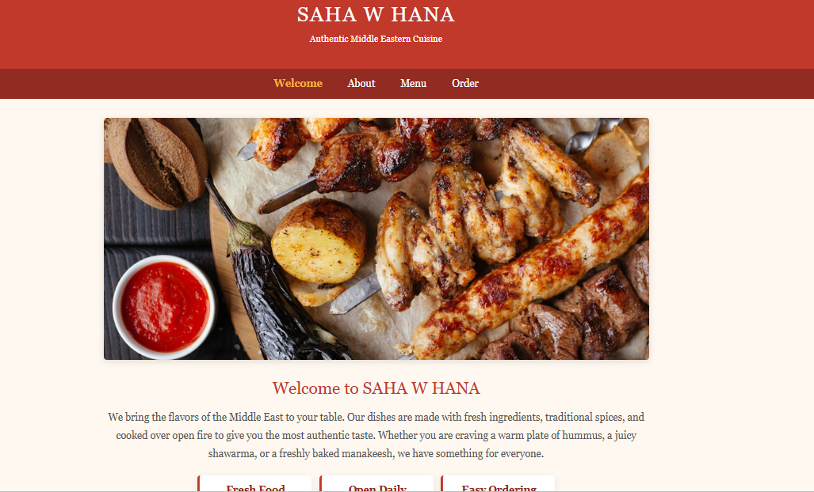
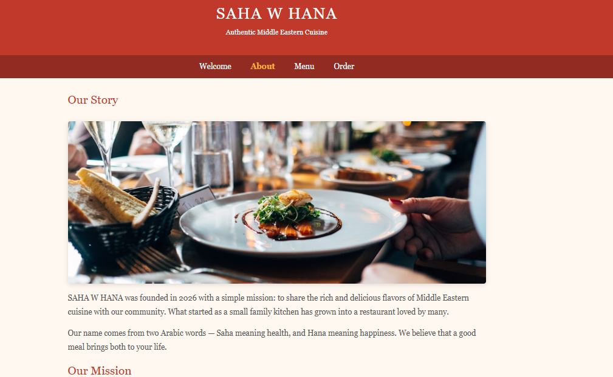
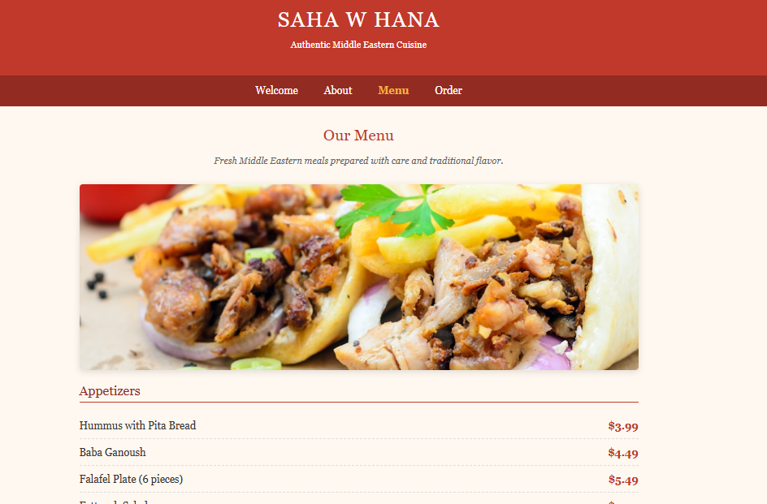
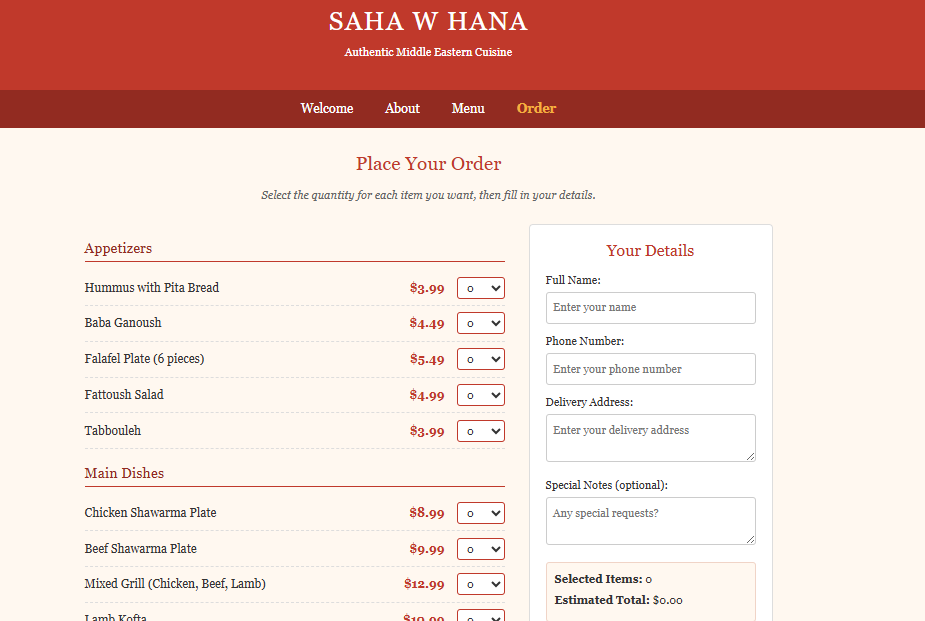

# SAHA W HANA Restaurant Website

## Project Description

SAHA W HANA is a ReactJS website for a Middle Eastern restaurant. The website allows visitors to read about the restaurant, view the menu, and place an order using a simple online form.

This Phase 2 version keeps the same idea and style from Phase 1, but it is rebuilt using ReactJS. The update adds reusable React components, Bootstrap support, responsive design, a small quick information section, and a live order total in the order form.

## Main Features

- Welcome page introducing the restaurant
- About page with restaurant story and contact information
- Menu page showing categories, food items, and prices
- Order page with quantity selection and customer details
- Live estimated total on the order page
- Simple hover effect on menu and order items
- Responsive layout for desktop and mobile screens

## Technologies Used

- ReactJS
- Bootstrap
- CSS
- JavaScript
- React Router
- GitHub Pages

## How to Run the Project

1. Download or clone the project.
2. Open the project folder in VS Code.
3. Open the terminal inside the project folder.
4. Install the required packages:

```bash
npm install
```

5. Start the project:

```bash
npm start
```

6. Open the website in the browser:

```txt
http://localhost:3000
```

## Website Pages

- Welcome
- About
- Menu
- Order

## Screenshots

Welcome Page


About Page


Menu Page


Order Page

